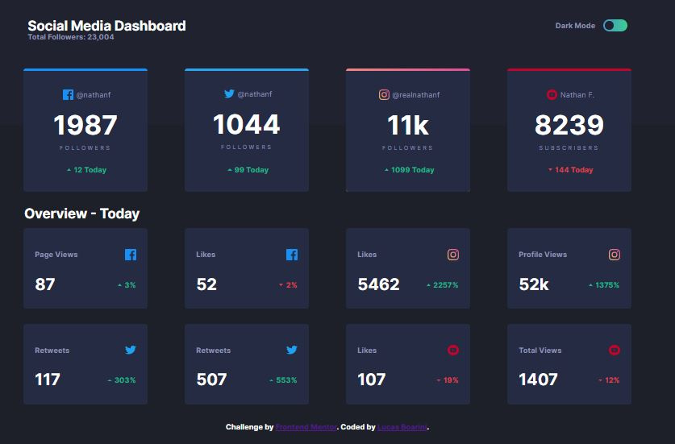
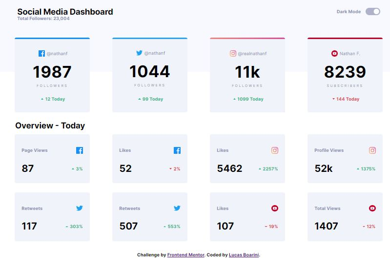

# Social Media Dashboard

Temos como proposta nesse projeto desenvolver um dashboard de mídias sociais e nele ter como opção a escolha da cor tema, respeitando o design sugerido e a responsividade.

## Menu

- [O Projeto](#o-projeto)
- [O que aprendi](#o-que-aprendi)
- [Screenshot](#screenshot)
- [Construido com](#construido-com)

### O que aprendi

Nesse projeto tive como objetivo melhorar minhas habilidades com o flexbox, para melhores resultados visuais e também dinâmica no desenvolvimento. Utilizando o flexbox tive a possibilidade de fazer um modelo e replicá-lo deixando os campos de exibição padronizados.
 E na função para troca de cores de tema aprendi como manipular algumas variáveis do CSS com o JavaScript.

### Screenshot

Abaixo temos um screenshot com o meu resultado nos dois temas:

Dark Mode:

Light mode:

### Construido com

As tecnologias utilizadas para esse projeto são as listadas abaixo:

- Semantic HTML5 markup
- CSS custom properties
- JavaScript

